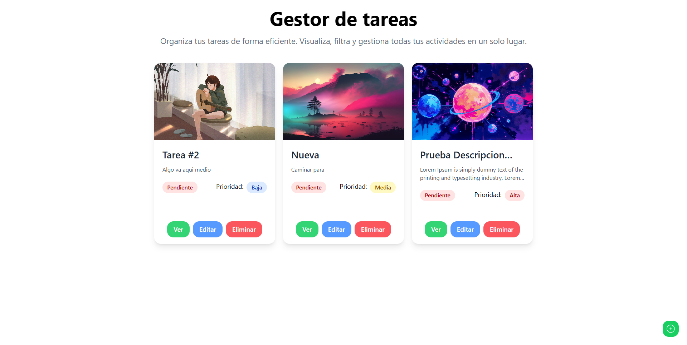
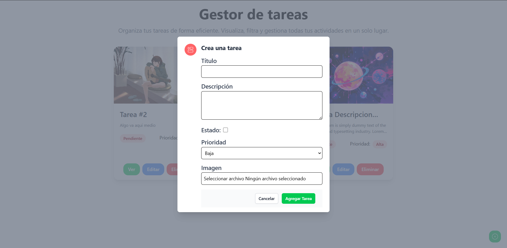
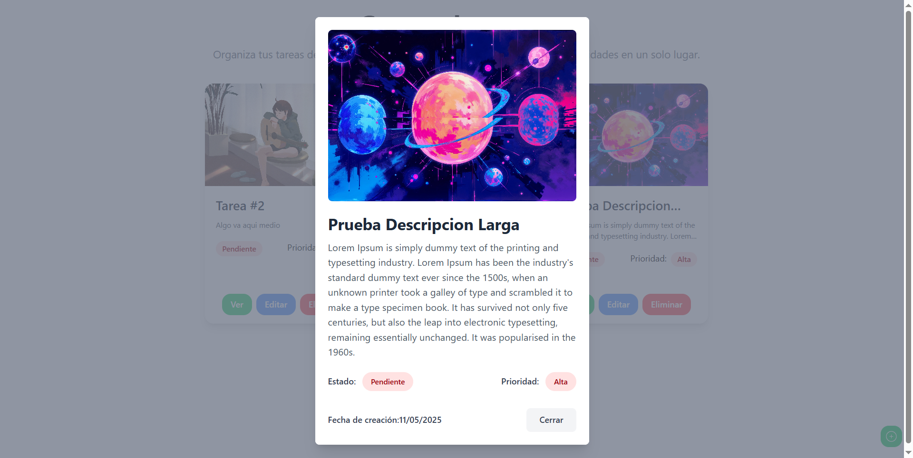

# 🚀 FullStack TodoApp

## 📝 Descripción

FullStack TodoApp es una aplicación completa de gestión de tareas que combina un frontend moderno y un backend robusto. Esta aplicación permite a los usuarios gestionar sus tareas diarias con características avanzadas como priorización, estados, y soporte para imágenes.

## ✨ Características Principales

- ✅ Gestión completa de tareas (CRUD)
- 📊 Sistema de prioridades (Alta, Media, Baja)
- 🔄 Estado de tareas (Completado/Pendiente)
- 📸 Soporte para imágenes en las tareas
- 📱 Diseño responsivo
- 🎨 Interfaz moderna y amigable
- 🔔 Sistema de notificaciones
- 📚 API documentada con Swagger

## 🛠️ Tecnologías Utilizadas

### Frontend
- React con TypeScript
- Tailwind CSS para estilos
- React Query para gestión de estado
- Axios para peticiones HTTP
- Headless UI para componentes accesibles
- Notyf para notificaciones

### Backend
- NestJS como framework de Node.js
- MongoDB para base de datos
- Mongoose como ODM
- Swagger/OpenAPI para documentación
- Multer para manejo de archivos
- Validación de datos con class-validator

## 🖼️ Capturas de Pantalla

### Vista Principal


### Modal de Creación/Edición


### Vista Detallada de Tarea


## 🚀 Inicio Rápido

### Requisitos Previos
- Node.js (versión 14 o superior)
- MongoDB instalado y en ejecución
- pnpm instalado globalmente

### Configuración del Backend

1. Navegar al directorio del backend:
```bash
cd backend
```

2. Instalar dependencias:
```bash
pnpm install
```

3. Crear archivo .env con las variables necesarias:
```env
PORT=3000
MONGODB_URI=tu_url_de_mongodb
ORIGIN_CLIENT=http://localhost:5173
```

4. Iniciar el servidor:
```bash
pnpm run start:dev
```

### Configuración del Frontend

1. Navegar al directorio del frontend:
```bash
cd Frontend
```

2. Instalar dependencias:
```bash
pnpm install
```

3. Crear archivo .env:
```env
VITE_API_URL=http://localhost:3000
```

4. Iniciar el servidor de desarrollo:
```bash
pnpm run dev
```

## 📚 Documentación

- Frontend: [Frontend README](Frontend/README.md)
- Backend: [Backend README](backend/README.md)
- API Docs: Disponible en `http://localhost:3000/api` cuando el backend está en ejecución

## 🤝 Contribuir

Las contribuciones son bienvenidas. Por favor, lee las guías de contribución antes de enviar un pull request.

## 📄 Licencia

Este proyecto está bajo la Licencia MIT - ver el archivo [LICENSE](LICENSE) para más detalles.